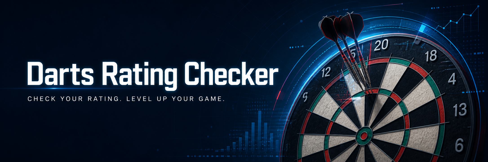

# 🎯 Darts Rating Checker

DARTSLIVEの80% STATSを参考に、01 STATSとCRICKET STATSからRatingの目安とFlightを確認できるシンプルなWebアプリです。

## Demo

https://darts-rating.github.io/darts-rating-checker/

## 概要

ダーツをしていると「このSTATSだとRatingはいくつくらい？」と換算表を確認したくなることがあります。

そこで、01とCRICKETのSTATSを入力するだけで、Ratingの目安をすぐ確認できるアプリを作りました。

## 主な機能

- 01 STATSからRatingを換算
- CRICKET STATSからRatingを換算
- 01とCRICKETのRatingから総合Ratingを表示
- Ratingに応じてFlightを表示
- 未入力時は0.00として表示
- スマートフォン表示に対応

## 使用技術

- HTML
- CSS
- JavaScript
- GitHub Pages

## 工夫した点

- ダーツをしていて実際に欲しい機能を題材にした
- STATSの範囲を条件分岐で判定
- 小数点2桁までRatingを表示
- 総合Ratingを目立たせた
- スマホでも使いやすいようレスポンシブ対応
- 未入力時やFlight表示も調整

## 学んだこと

HTMLで画面を作り、CSSで見た目を整え、JavaScriptで入力値の取得・条件分岐・計算・画面表示を行う基本的な流れを学びました。

また、スペルミスやID名の不一致などで動かない時に、原因を探して修正するデバッグも経験しました。

## 今後追加したい機能

- 入力値のチェック強化
- UIの改善
- 判定結果のアニメーション
- Rating換算表の表示
- 過去の結果保存
-  Phoenixのレーティング計算の追加

## 注意

このアプリはDARTSLIVEの80% STATSを参考にしたRating換算の目安を表示する個人制作アプリです。公式のRating算出結果を保証するものではありません。
